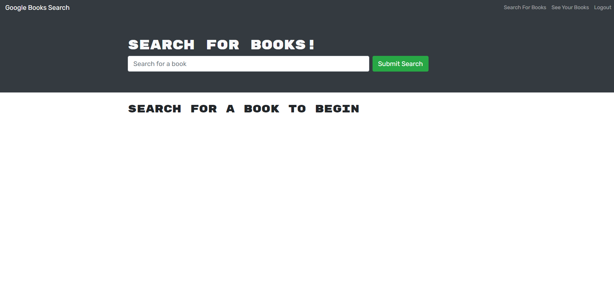

# Book-Search

## Description 
The goal of the project is to create a Book search egine that can find any book from google.

**The following problems are solved,**

-Schemas created

-Includes resolvers and type defs

-Query and Mutation types created

-User,Book and Auth types created

-

**Throught the project i learnt the following,**

-Using nodejs

-Using graphql, mongodb mongoose

-Heroku to deploy the app

https://desolate-springs-54704.herokuapp.com/
https://github.com/PJoll/Book-Search

Below are screenshots of the deployed app

